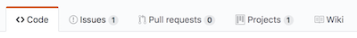
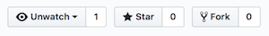

# GitHub Interface

## Useful tabs

The key tabs we'll be using a lot within each team's GitHub repository:

- `Code` - shows the files in the repository.

- `Issues` - shows a list of Issues. In our case, any Issue will represent any of a User Story, Task, or Spike.

- `Pull Requests` - shows a list of pull requests, if any.

- `Projects` - will contain all Scrum Task Boards for each Sprint that must be kept up to date.

- `Wiki` - useful for storing schedules, team charts, any collaborative documents that do not need to be stored in the repository itself.

## Useful buttons

- `Watch`

  - `Watching` - sends notifications when a pull request, commit, or issue closing event occurs.
  - `Not watching` - will be notified if you are a participant in a discussion or you are specifically mentioned.

- `Star` - bookmarks the repository on your GitHub dashboard.
- `Fork` - clones the repository into your own GitHub account.
