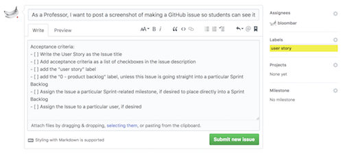
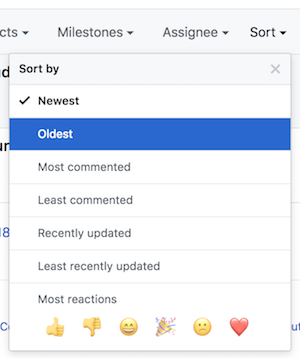

# Issues

GitHub has a built-in issue management system.

- An Issue typically represents either a bug, a new feature, or a project requirement.

- an Issue tracker is essentially a way to track the work left to be done

- if the "Issues" tab does not appear in your GitHub repository's main row of tabs, add Issues to your repository's Options in the `Settings` tab.

- if following the Scrum or similar Agile development process, it is useful to [label](./github-labels.md) any Issue as any of a `user story`, a `task` or a `spike` to differentiate among them.

### Creating a new issue

Click `New issue` button

- enter title and initial description as a comment (supports Markdown)
- can drag-and-drop images or screenshots to the issue comment, if desired
- you can use `@` to mention a particular GitHub user to get their attention
- you can reference other Issues by indicating their number (including the `#` sign). This is very useful, as GitHub will automatically make that number into a link to the other Issue.



It's easy to make a checklist of sub-tasks in an issue comment, by using Markdown syntax. This can be very useful for tracking Acceptance Criteria of a User Story or sub-elements of a particular task`

```
- [ ] Item 1
- [ ] Item 2
- [ ] Item 3
```

### Assigning issues to individuals

Issues can be assigned to individual(s) to clearly document who is supposed to be working on it. This is important for avoiding conflict resolution and making it clear who has or has not done their work.

User Stories are not assigned to team members. But any Task or Spike currently being worked on (i.e. units of work in the current Sprint Backlog, if following the Scrum or similar Agile development framework) should be assigned to an individual or several individuals.

No Task or Spike should sit on a Sprint Task Board unassigned.

### Maintaining an issue

Once created, contributors can leave a thread of communications as comments in this Issue

- contributors can check off items from a checkbox included in an Issue's description and see that progress reflected in the main Issues list view
- GitHub's Issue tracking functionality allows contributors to easily add [Labels](./github-labels.md) and [Milestones](./github-milestones.md) to Issues.

Keep an eye on Issues that may need some attention:

- sort Issues by `Oldest` or `Least recently updated` to see Issues that have stuck around for some reason
- sort Issues by `Most commented`. Open Issues with many comments may indicate a need for some sort of intervention or conflict resolution to get the Issue closed
- sort Issues by `Least commented`. Old Issues with no comments may need you to `@` mention someone to get some attention or conversation around the Issue



### Closing an issue

Click the `Close issue` button.

- include a message describing the resolution and any lingering issues
- Issues can be automatically closed from a Git commit to the repository that includes a commit messages such as `Closes #43`, where `43` is the issue number that will be automatically closed.
