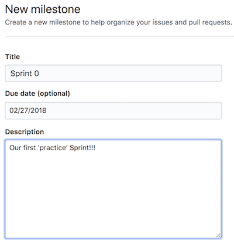

# Milestones

GitHub's [Issue tracker](./issues.md) allows you to mark Issues as belonging to particular Milestones - important moments in time of a project.

- Click the `Milestones` button in the project's `Issues` tab to manage milestones.
- Click `New milestone` to create a new one

## Sprint management

Milestones are especially useful in Agile development, where work is earmarked for particular Sprints.

- individual [Issues](./issues.md) can be added to particular Milestones

The Milestones view shows progress towards each Milestone, including:

- percent completion
- number of open issues
- number of closed issues

In this course, we'll create Milestones for each of our project's Sprints:

- Sprint 0
- Sprint 1
- Sprint 2
- Sprint 3
- Sprint 4

What to include in the Milestone settings:

- a description of the big picture of what the Sprint is aiming to achieve
- the due date for the Sprint, as indicated by the due date of the Stakeholder Demos on the course schedule

Add Issues from the Product Backlog to a Sprint Backlog as follows:

- add the "Sprint _N_" Milestone to the Issues, where _N_ is the current Sprint number

## Closing milestones

Milestones must be closed on their due dates

- any open Issues within a closed Milestone must be added back to the Product Backlog... this requires no action on your part.
- leave the "Sprint _N_" Milestone on those open Issues, where _N_ is the just-completed Sprint number... do not remove this!

## Creating releases

It is customary to issue a new product **Release** at the end of each Milestone. This can be accomplished from within GitHub by clicking the `Create a new release` link from the main repository page.
