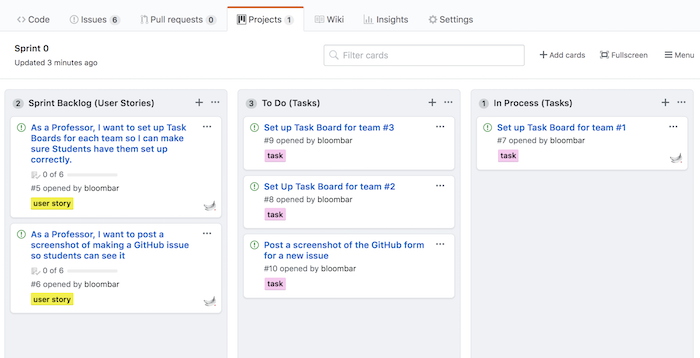
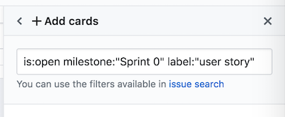
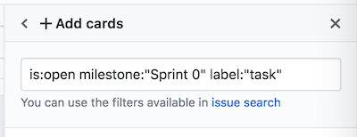

# Task Boards

It is possible in GitHub's `Projects` tab to create Scrum-style [Task Boards](https://knowledge.kitchen/Scrum_development_framework#Task_board) that show User Stories and Tasks and Spikes organized into visual groupings.

Each repository must have a separate Task Board set up for each Sprint.

GitHub's Task Boards are relatively primitive and require a good amount of maintenance to keep them up-to-date. But they can be extremely useful for keeping track of the status of a sprint.

## Set up a GitHub Task Board

Create a GitHub "Project Board" that works as a Task Board for a Scrum-style Sprint:

1.  Go to a repository
1.  Click on the `Projects` tab
1.  Create a new Project and name it something like, `Sprint 1 Task Board`

## Configure it to be Scrum-friendly

Make this into a Scrum-style Task Board by adding the following columns:

1. **Sprint Backlog (User Stories)** - this will contain the User Stories to be done within the given Sprint
1. **To do (Tasks)** - this will contain the individual tasks that are necessary to implement the User Stories in Sprint Backlog
1. **In process (Tasks)** - tasks will be moved here from the To Do column once they are actively being worked on
1. **Awaiting review (Tasks)** - tasks that have been completed but require peer review before merging into the trunk should be moved here
1. **Done (Tasks)** - tasks will be moved here when they are completed

## Fill in the Task Board with Issues

Add all User Stories for the given Sprint into the **Sprint Backlog** column.

- If User Stories have been entered into GitHub's Issues tracker, properly [labeled](./github-labels.md) with the `user story`, and given the proper Sprint [milestone](./github-milestones.md), it is easy to search for them within the Project Board screen using a search term such as, `is:open milestone:"Sprint 1" label:"user story"`
  

Add all Tasks for each User Story into the **To Do** column

- If Tasks have been entered into GitHub's Issues tracker, properly [labeled](./github-labels.md) with the `task` label and given the proper Sprint [milestone](./github-milestones.md), it is easy to search for them within the Project Board screen using a search term such as, `is:open milestone:"Sprint 1" label:"task"`
  

## Keep the Task Board Up-To-Date

Maintain the Task Board as you work on the Sprint.

- move Tasks into appropriate columns every day as you work on them
- treat Spikes the same as Tasks
- leave user stories in the Sprint Backlog column and do not move them.

## Closing a Task Board at completion of a Sprint

Task boards serve as an archive of what was and was not accomplished within each Sprint.

- Leave the task board frozen as-is when a Sprint is completed... do not remove or reposition any issues
- Follow [the instructions for how to place incomplete User Stories back into the Product Backlog](https://knowledge.kitchen/GitHub_for_team_collaboration#Closing_milestones) using GitHub's labels, but don't remove them from the completed Sprint task board.
- Making any other changes to the task board after a Sprint has completed could be considered misleading and disingenuous.
